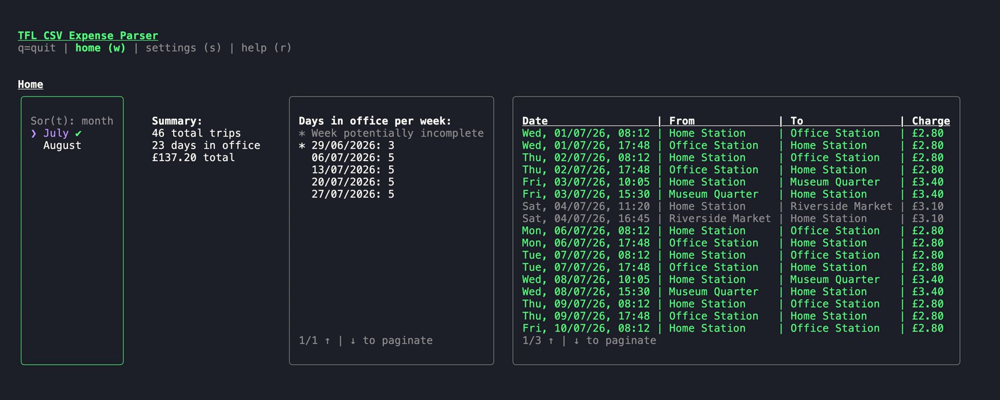
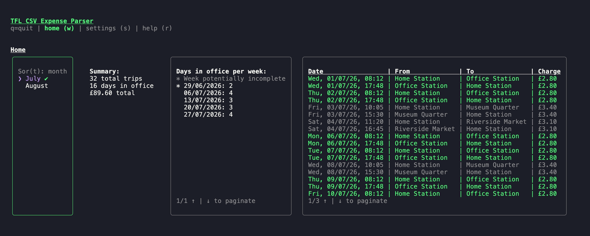

# TFL Expenses App

Tired of calculating TFL expenses? This tool provides several useful summaries to make expensing a breeze.



## Table of contents

- [Installation](#installation)
  - [Prerequisites](#prerequisites)
  - [Uninstall](#uninstall)
- [Keyboard shortcuts](#keyboard-shortcuts)
- [Features](#features)
  - [Configure multiple home and work stations](#configure-multiple-home-and-work-stations)
  - [Highlight anomalies at a glance](#highlight-anomalies-at-a-glance)
  - [Group by file or by month](#group-by-file-or-by-month)
  - [Count office days by week](#count-office-days-by-week)
  - [Paginate long journey lists](#paginate-long-journey-lists)

## Installation

### Prerequisites

- Node.js 18+ and npm

```
sh install.sh
```

The `tfl` command is now available anywhere in your terminal.

- Run `tfl`. This will create a config file in `~/.tfl-expense-calculator/config.json`
- Download your Pay as you go journey history CSV from your TfL account and drop it in the app folder (default `~/.tfl-expense-calculator/`, configurable in settings)

### Uninstall

```
sh uninstall.sh
```

## Keyboard shortcuts

- `w` home, `s` settings, `r` help, `q` quit
- `Tab`/`Shift+Tab` to move focus between panels, arrow keys to scroll the focused one
- `t` to toggle grouping by file or month

## Features

### Configure multiple home and work stations

Like a little walk after work? Set multiple home and office stations so you don't miss a trip.


### Highlight anomalies at a glance

Get an overview of your tube journeys while still having the details easily accessible and verifiable. Clearly see any
anomalies in accounting.


### Group by file or by month

Swap between arrange by file and by month. No more having to juggle multiple files.



### Count office days by week

Per diems made easy with a weekly sum of how many days you were in the office. Never miss a day with smart highlighting
of incomplete weeks


### Paginate long journey lists

Travel a lot in a month? Look at all your journeys with ease.


